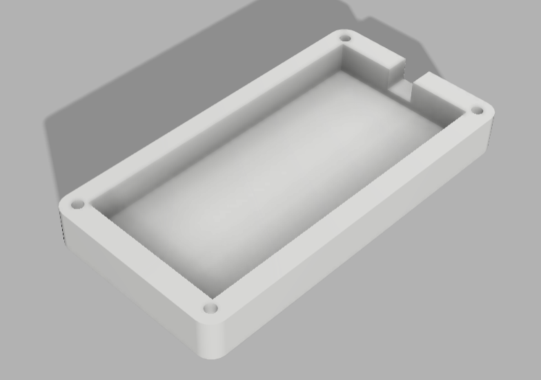
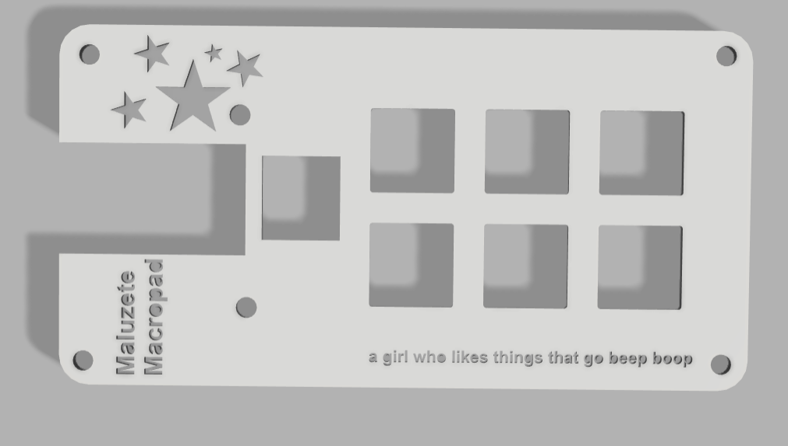
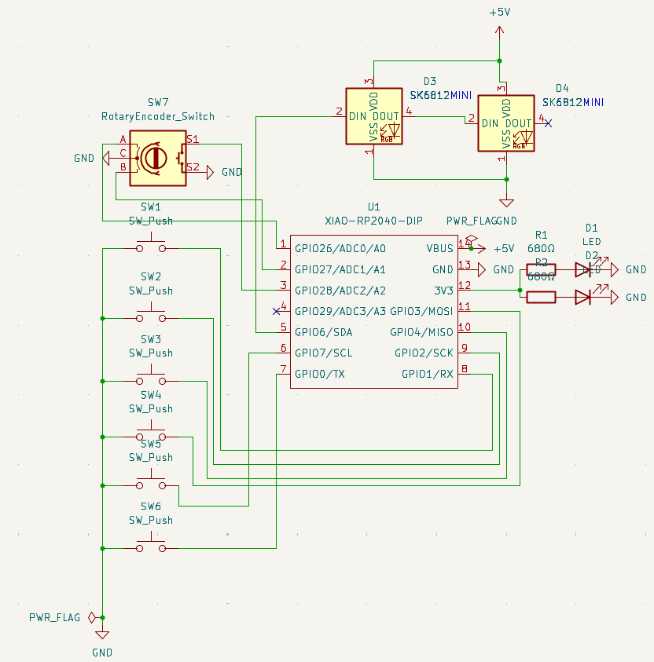
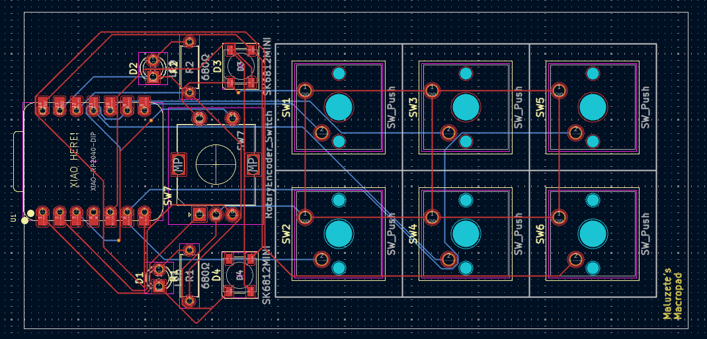
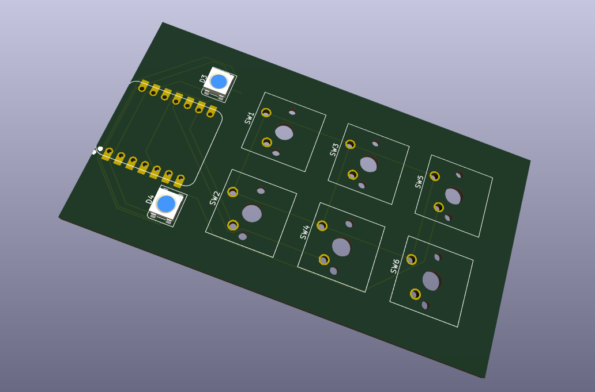

# Malu's Macropad


A compact 6-key programmable macropad built around the Seeed XIAO RP2040. 
This project focuses on a clean, simple 2×3 key layout, a custom PCB, and a cute 3D-printed case.
Designed from scratch as my first full hardware project, this macropad is mainly aimed at programming and competitive programming workflows, with custom macros for VS Code and common coding actions.

---

## Features

- 6 programmable mechanical keys (2×3 layout);
- Seeed XIAO RP2040 microcontroller;
- Custom PCB designed in KiCad;
- Custom 3D-printed case and plate designed in Fusion 360;
- Firmware based on KMK+CircuitPython;
- Designed for programming and competitive programming macros.

---

## Tools & Technologies

| Area              | Tool / Technology |
|-------------------|-------------------|
CAD (Case & Top)   | Fusion 360        |
PCB Design           | KiCad             |
Firmware             | KMK (CircuitPython) |
Programming          | Python            |
Version Control      | Git & GitHub      |
Code Editor          | VS Code           |

---

## Project Preview

### Case Design (Fusion 360)



### PCB & Schematic (KiCad)




---

## Repository Structure
```
├── README.md
├── diary.md
├── firmware/
│ └── main.py
├── pcb/
│ ├── macropadmaluu.kicad_pcb
│ ├── macropadmaluu.kicad_pro
│ └── macropadmaluu.kicad_sch
├── case/
│ ├── topmacropad.f3d
│ ├── casemalumacropad.f3d
└── docs/
│ ├── images/
```
---

## Development Log
A detailed development log is available in: ``` journal.md ``` :)
